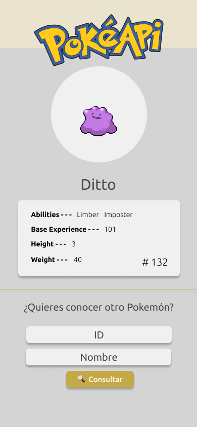
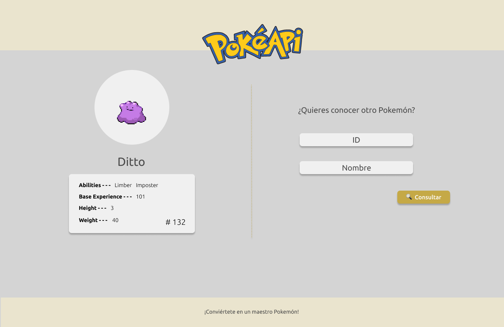

# PokeApp

## Description

This application try to be similar to a Pokedex, using the [PokeApi]( https://www.youtube.com/watch?v=IFWvfZaKF_w) like source of information. Beside the Api information, the application is in Spanish language.

## MockUps

The mockups were built in [Figma](https://www.figma.com/).

## Pokemon information:
- Image
- Name
- Abilities
- Base Experience
- Height
- Weight
- Type

## Stack

This application was built in ReactJS like the Front-end technology. Is based in hooks too.

The desing was made with sass and has two sizes:
- width 360 to 414 pixels.
- width 415 pixels and up.

## Expected usage

When deploy, to use it, the user introduce an ID or a Pokemon's name in the input box and clicked the "Consultar" button. Then the Pokemon information is displayed on the left side of the screen.

## Demo

Mobile version: https://youtu.be/YOaHav2fgZ8

PC version: https://youtu.be/O-r_-yqYzW8

## Author
- Daniela Botero Restrepo - [GitHub](https://github.com/DaboRestrepo) - daborestrepo@gmail.com